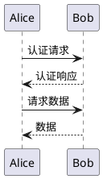
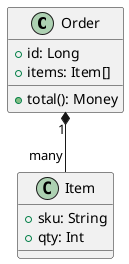
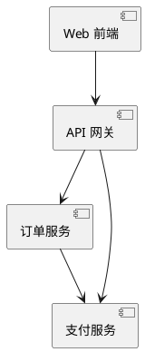
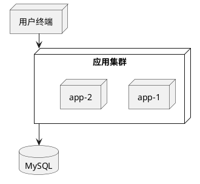
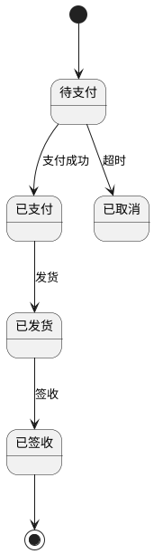
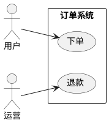
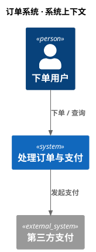

# 语法与模板

所有图都用 `@startuml ... @enduml` 包裹。下面每种图给一个最小可改模板；复杂语法查 [plantuml.com](https://plantuml.com/) 官方手册。

## 时序图（sequence）

`->` 实线箭头、`-->` 虚线箭头；参与者自动声明；`participant`/`actor` 可显式声明并改名。

## 类图（class）

`*--` 组合、`o--` 聚合、`-->` 关联、`..>` 依赖、`--|>` 继承。

## 组件图（component）

## 部署图（deployment）

## 状态图（state）

## 用例图（usecase）

## C4 架构图

公共 server / Kroki **不能** `!includeurl https://...` 远程拉取；C4 必须用打包的标准库形式：

容器 / 组件层同理用 `!include <C4/C4_Container>`、`!include <C4/C4_Component>`。

## 皮肤与主题

```plantuml
@startuml
skinparam monochrome true       # 黑白线条，适合文档
skinparam backgroundColor #FFFFFF
' !theme cerulean              # 主题；公共 server 支持内置主题
Alice -> Bob : hi
@enduml
```

`skinparam` 调细节（monospace、padding、backgroundColor 等），`!theme` 套整体主题。

## 常见坑

- 公共 server / Kroki 无法 `!includeurl https://...`：远程 include 会失败，改用打包标准库（如 `<C4/...>`）或本地 jar。
- 异形 shape、过重 `skinparam`、sprites/图标、自定义字体是渲染失败的首批嫌疑——排错时先删这些（见 [troubleshooting.md](./troubleshooting.md)）。
- 标签含 `:` `|` 等特殊字符时用引号包住：`Alice -> Bob : "a:b | c"`。
