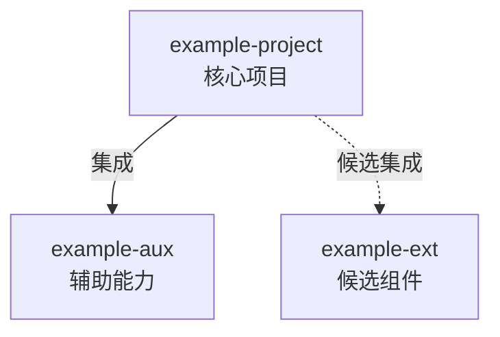

<!--
模板用途：生成壳工作空间的项目体系地图（docs/project-map.md），总领全部项目、相互关系与体系原则。
占位符：{{workspace_name}} 壳项目/工作空间名；{{tagline}} 体系名称或一句话口号。
生成时填充占位符并删除本注释及正文内各处提示注释。
-->

# 项目体系地图

{{workspace_name}} 是「{{tagline}}」项目体系的根工作空间。本文是体系的总领地图：列出全部项目、相互关系与体系原则。各项目细节见其规划文档。

## 项目清单

<!-- 以下为示例项目小节，按实际项目增删。注意：本文件在 docs/ 下，「规划文档」链接相对本文件解析 → projects/<名>/README.md，指向的是 docs/projects/（立项文档），不是根目录的 projects/（挂载落点），两者同名易混 -->

### example-project

- 定位：一句话说明项目做什么、面向谁、目标平台，必要时补充实现顺序。
- 状态：规划中 / 仓库已建未挂载 / 已挂载 / 已发布——按实际选一个，全空间统一用同一套词。
- 规划文档：[projects/example-project/README.md](projects/example-project/README.md)
- 挂载：（路由 B 才需要）clone / link（目标 ...）/ 未挂载（仓库未建）。
- 与其他项目的关系：列出与体系内其他项目的集成、依赖或候选关系；无则写「暂无」。

## 关系图

<!-- 最小示例骨架，按实际项目增删节点与连线；实线表示既定关系，虚线表示候选关系，两者分别画在不同节点对上 -->

## 体系原则

<!-- 本小节登记体系级通用原则。下列为方法论通用条目，按体系实际情况增删；具体技术决策不得预填，须由问询结果填写 -->

- 多仓库而非 monorepo：各项目拥有独立产品线，多仓库形态与之匹配；工作空间的运作细节见 [guide.md](./guide.md)。
<!-- 示例方向（按问询结果登记，勿预填具体技术决策）：投入优先级（各项目/形态的优先次序）、集成方式（体系内组件如何被核心复用）等 -->

## 待探讨

当前暂无条目。体系层面悬而未决的问题在此逐条登记，每条一行并链接相关文档。
